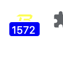

Chrome extension showing blast next spin time.

How to use:
1.Open Chrome and navigate to chrome://extensions/.
2.Enable "Developer mode" at the top right.
3.Click "Load unpacked" and select the folder containing your extension files.
4.Test the extension on various pages to ensure it's working correctly.

Screenshot
